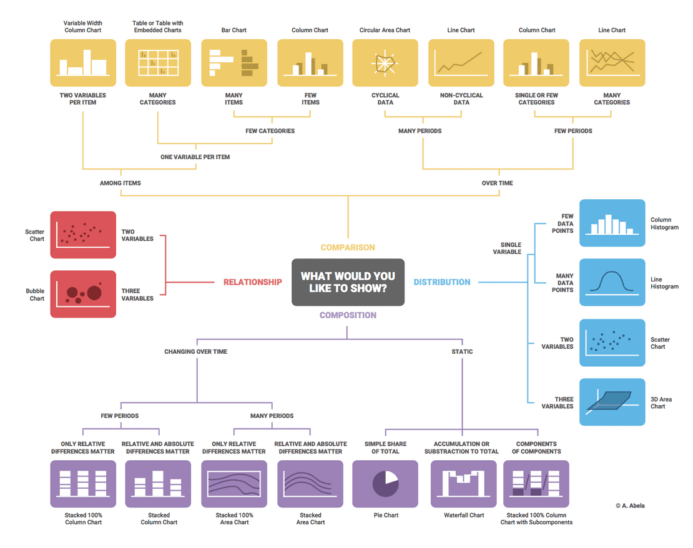

# Tata Virtual Case Experience

This Virtual Experience case is held by Tata. In this virtual experience programme, I am being put in the point of view of a data visualization analyst at Tata iQ, a division of Tata Limited Industries that provides analytics and solutions, to address various stakeholders needs. The expectation is set to understand the stakeholders objectives and translate those into apt and intuitive dashboard or visualizations. The visualization is aimed to bring impact by delivering insights that might be applicable to empower business. **There are 4 Tasks to complete in this case, i.e.:** Framing the Busines Scenario, Choosing the Right Visuals, Creating Effective Visuals, Communicating Insights and Analysis.

## 1. Framing the Business Scenario
### Lesson Learned:
1. Thinking from the perspective of business leaders to analyse data more effectively
2. Preparing for a meeting with senior leaders

### Tasks:
Writing questions that will be important and relevant to the CEO and CMO. The questions will be based on the datasets resource provided as the basis for exploration

### Datasets Source:
`https://cdn.theforage.com/vinternships/companyassets/ifobHAoMjQs9s6bKS/5XsFFJu2oCLdmYJW2/1654128941410/Online%20Retail.xlsx`

(The above dataset source links was last accessed in November 9, 2023)

### Solutions:
**Questions for CEO:**

1. The CEO would like to know the current condition of the business, so that he/she can have a bird view of its current business state of the corresponding online retail company. In order to address this issue, 4 metrics will be provided in the report, i.e.: Total Revenue, Total Orders, Total Transactions, and Total Number of Customers.
2. The CEO also needs to have a glance of the business throughout the time the business has been running. Provided the Information of the revenue and order by monthly and annual basis, the CEO would be able to see the seasonal pattern.
3. CEO also needs the information of the monthly and annual revenue and order to forecast the business in the following year.
4. The demography of the customers based on the place where they live (by country/globally) would enable the CEO to determine to which area to he / she wants to expand its business. In order to address this issue, a visual map will be provided.

**Questions for CMO:**

1. The CMO needs to find out the Top 10 Customers with the most orders, so that he can nominate and provide Loyalty Award or Program to the correct customers.
2. The CMO needs the information about the Top 10 Countries that generates the most revenue so that they can maintain the business relationship built so far.
3. CMO needs to know the Top 10 sold items so that they can maintain what they are good at providing for.
4. Understanding the product demography based on the country in which they are sold enables the CMO to craft or tailor the marketing strategy for each different country.

## 2. Choosing the Right Visuals
### Lesson Learned:
Choosing visuals to communicate information effectively

### Tasks:
Identifying the visual which would explain the data and insights in the simplest possible manner

### Solutions:
Using Dr. Andrew Abela's method we can determine which visualization suitable to communicate our datasets.

## 3. Creating Effective Visuals
### Lesson Learned:
1. Visualizing data analysis to help executives with effective decision making
2. Using Tableau or PowerBI softwares

### Tasks:
**Creating the visuals around the questions the CEO and CMO requested:**
1. The CEO of the retail store is interested to view the time series of the revenue data for the year 2011 only. He would like to view granular data by looking into revenue for each month. The CEO is interested in viewing the seasonal trends and wants to dig deeper into why these trends occur. This analysis will be helpful for the CEO to forecast for the next year.
2. The CMO is interested in viewing the top 10 countries which are generating the highest revenue. Additionally, the CMO is also interested in viewing the quantity sold along with the revenue generated. The CMO does not want to have the United Kingdom in this visual.
3. The CMO of the online retail store wants to view the information on the top 10 customers by revenue. He is interested in a visual that shows the greatest revenue generating customer at the start and gradually declines to the lower revenue generating customers. The CMO wants to target the higher revenue generating customers and ensure that they remain satisfied with their products.
4. The CEO is looking to gain insights on the demand for their products. He wants to look at all countries and see which regions have the greatest demand for their products. Once the CEO gets an idea of the regions that have high demand, he will initiate an expansion strategy which will allow the company to target these areas and generate more business from these regions. He wants to view the entire data on a single view without the need to scroll or hover over the data points to identify the demand. There is no need to show data for the United Kingdom as the CEO is more interested in viewing the countries that have expansion opportunities.

### Solutions:

For this case solution, I use the Power BI to make visualization dashboard. Details of the visuals used in the dashboard, are as follow:

1. In order to complete the first task, I chose the Line Chart for the visualization to describe the revenue trend during the period of 2011. The chart depicts the Revenue on its vertical axis and the time of period in the horisontal axis.

2. The Top 10 Countries that generated most Revenue and Quantity can be efficiently depicted by a Vertical Bar Chart. The Countries in the vertical of the chart axis are sorted by Revenue and Quantity. 

3. The Top 10 Customers that generates the most Revenue can be viewed by a Horizontal Bar Chart as depicted below:

4. To describe the regions in which the product experienced the most demand, I display the information in a geographical map. 

Since the CEO also required the **United Kingdom be excluded from the dashboard, I applied the visual level filter excluding the country of United Kingdom from the map. Besides that, I also added the Tata symbol, as well as the Score Cards for Total Revenue, Quantity Order, Total Transaction, and Total Customers.** The final design of the dashboard is depicted blow in 2 styles, i.e.: the Dashboard layout view and the Mobile layout view.  

a. Desktop Layout View

b. Mobile Layout View

## 4. Communicating Insights and Analysis

### Lesson Learned:
Presenting effectively to senior leadership

### Tasks:
Recording a video to present findings to the CEO and CMO

### Solutions:
The objective of this tasks is to conduct analysis and present findings or insights to the CEO and CMO. As per stated in the questions above, there are at least 4 things we can analyze based on the required 4 visualizations.

1. We can see that the revenue varied up and down over the first 5 months (January to May), ranging from $ 0.52M to $ 0.77M and was followed by a relatively steady trend in the next 3 months (June to August), before started to climb in the following 3 months (September, October, and November) with revenues of $ 1.06M, $ 1.15M, and $ 1.51M respectively, and eventually dropped to $ 0.64M in December. It is hard to predict the cyclicality or seasonality of the trend since we only use one period (1 year) of the fluctuated revenue data. Nonetheless, we still can predict that the revenue would climb up in a few months before the year ends and that could happen annually. Therefore, we need to have good preparation both for the goods that would be sold as well as the resources needed during the corresponding period. 

2. Based on the chart depicting the Top 10 Countries that generated the most Revenues, Netherlands generated the most with Revenue of $ 285K and Sold Quantity of $ 201K, followed by EIRE, Germany, France, Australia, Spain, Switzerland, Belgium, Sweden, and Japan in the last position with only Revenue of $ 37K and Sold Quantity of $ 26K. All increements of the revenue are in line with the increasing quantity of goods sold. Therefore, the supply of the goods must be well maintained. The CMO and the team must also maintain good relation with established customers in the corresponding Top 10 Countries, while preparing strategy, should the company intend to expand its business outside the area of the Top 10 Countries.

3. The Customer with Customer ID of 14646 is the customer who generated the most revenue with purchase converted to revenue of $ 280K, allowing him/her to peak the list of the Top 10 Customers. The 10th position is customer with Customer ID of 12346 that generated Revenue of $ 77K. CMO can use the Chart to target higher revenue generating customers for their loyalti program to ensure them satisfied with the products sold.

4. Based on the Map Chart (Geographical Chart), we can consider the high number of quantity sold as reflecting the demand in the regions. The higher the quantity sold, the higher the demand in the corresponding region. This is depicted in the size of the bubble on the Map. Netherland placed the first position as the region with highest demand, followed by EIRE and Germany. Therefore, if the CEO wants to create expansion strategy based on the demand, CEO can target the plan to the highest 3 regions, eventhough the possibility to expand either in the Top 10 regoins or outside the Top 10 regions is always open to be executed.

### Link of the dashboard:
The online report of the power bi can be found [here](https://app.powerbi.com/groups/me/reports/ade3d66f-7bc5-4146-98c5-647532b84c5e/ReportSection?experience=power-bi)
